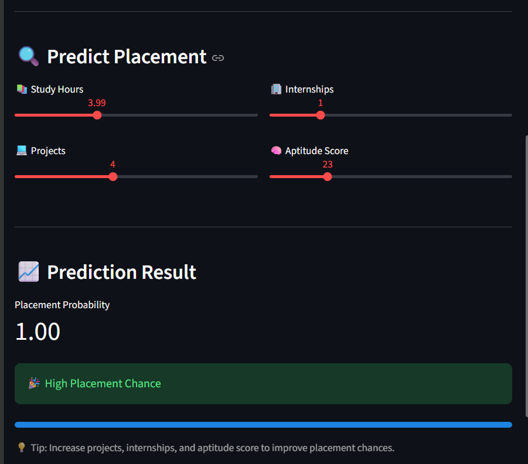

# 🎯 Student Placement Predictor

A data-driven web application that predicts student placement chances using academic performance and skill-based features.

## 🚀 Features
- Custom Logistic Regression model (built from scratch)
- Multi-feature prediction system
- Train-test split evaluation
- Interactive Streamlit UI
- CSV dataset upload
- Real-time predictions

## 📊 Input Features
- Study Hours
- Projects
- Internships
- Aptitude Score

## ▶️ Run Locally
```bash
pip install streamlit
streamlit run app.py

## 📸 UI Preview

### 🏠 result


### 📊 Prediction Result


